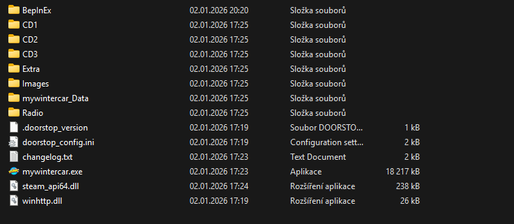

# MWC – Čeština (cs-CZ)

## Autoři a zdroje
- Autor lokalizačního pluginu:  
  https://www.nexusmods.com/mywintercar/mods/197
  
  https://github.com/potatosalad775/MWC_Localization_Core
  
- Některé překlady vycházejí ze staré češtiny z MSC:  
  https://www.nexusmods.com/mysummercar/mods/1384

---

## Požadavky
⚠️ **Plugin vyžaduje `BepInEx` ve verzi `5.x` nebo novější.**  
Bez něj čeština **nebude fungovat**.

---

### 1️⃣ Instalace `BepInEx`
> **Pokud už jsi My Winter Car někdy modoval, je velmi pravděpodobné, že BepInEx už máš a tento krok můžeš přeskočit.**

Návod pracuje s verzí **v5.4.23.4**, ale pravděpodobně můžeš použít i novější.

1. Stáhni BepInEx (x64):
   https://github.com/BepInEx/BepInEx/releases/download/v5.4.23.4/BepInEx_win_x64_5.4.23.4.zip
2. Otevři stažený ZIP.
3. **Důležité:** Obsah ZIPu zkopíruj přímo do hlavní složky hry, kde se nachází `mywintercar.exe`.
   - *Cesta bývá např.:* `G:\SteamLibrary\steamapps\common\My Winter Car`

Nějak takto by měla vypadat tvoje struktura:

> **⚠️Hra v momentální chvili nebude fungovat.**
> Je to způsobeno configem BepInEx v `MWC instalace/BepInEx/config/BepInEx.cfg` (pokud si hru zkoušel pustit) obsahuje defaultně nastavený `Type = Application`, ale správná hodnota pro MWC je `Type = MonoBehaviour` (tento konfig obsahuje čeština se správnou hodnotou)

### 2️⃣ Instalace `češtiny`
1. Stáhni nejnovejší verzi z: https://github.com/MrZajic/MWC_cs-CZ/releases (soubor `MWC_cz-x.x.x-x.zip`)
2. Otevři stažený ZIP a jeho obsah opět zkopíruj do hlavní složky hry (`.../common/My Winter Car`).
3. **Potvrď přepsání souborů**, pokud se systém zeptá.

---

⚠️ **Dokonalé to není ❤️. Některé labely chybí a stejně tak se MWC bude aktualizovat.** ⚠️

---
### 🔄 Aktualizace `češtiny`
1. Stáhni nejnovejší verzi z: https://github.com/MrZajic/MWC_cs-CZ/releases (soubor `MWC_cz-x.x.x-x.zip`)
2. Otevři stažený ZIP a jeho obsah opět zkopíruj do hlavní složky hry (`.../common/My Winter Car`).
3. **Potvrď přepsání souborů**. Pokud k přepsání nedojde, tak jsi to pravděpodobně rozbalil špatně.
(je to stejné jako instalace)
